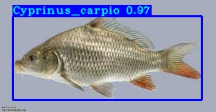

# Pakistani Freshwater Fish Species Detection — YOLOv3 & YOLOv4 (TensorFlow 2.x)

Code accompanying our PLOS ONE (2026) paper on YOLO-based classification of Pakistani freshwater fish species.



## Overview
YOLOv3 and YOLOv4 detectors trained to identify six Pakistani freshwater fish species:
**Catla, Cyprinus carpio (Common carp), Grass carp, Mori, Rohu, Silver carp.**

Per-class evaluation results are in `mAP/results.txt`.

## Setup
```bash
pip install -r requirements.txt
```

## Trained weights
Trained weights are not stored in this repository due to file size and are available on request.
Place them in `checkpoints/`.

## Usage
```bash
python detection_demo.py   # run detection
python train.py            # train on a custom dataset
```
Class names: `model_data/fish_pak_name.txt`

## Dataset
The dataset is available from the author on request.

## Acknowledgement
Built on [TensorFlow-2.x-YOLOv3](https://github.com/pythonlessons/TensorFlow-2.x-YOLOv3) by PyLessons (MIT License).

## Author
Zain Farooq — University of Sargodha, Pakistan
